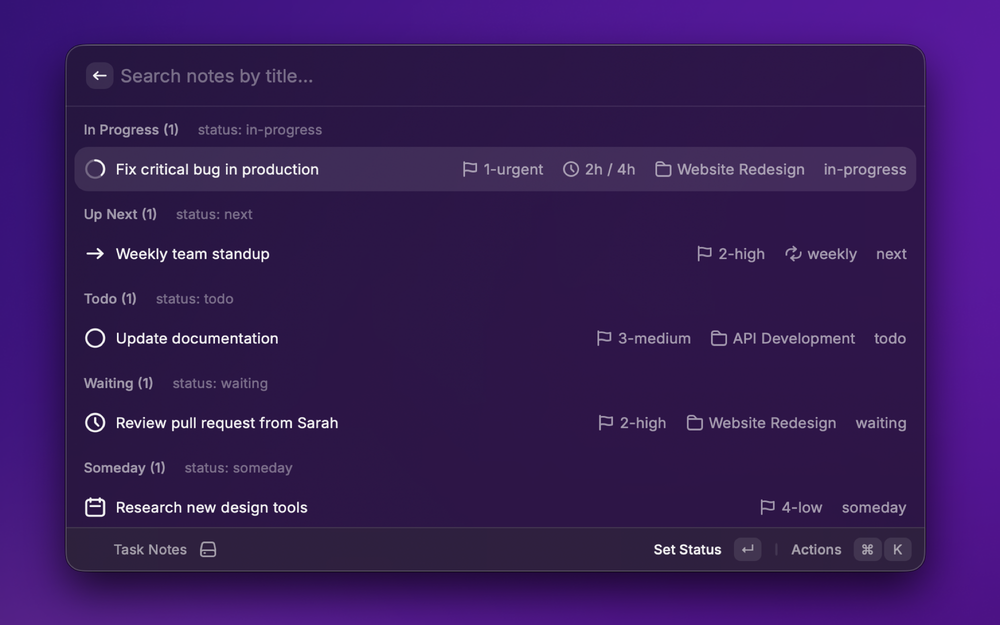

# hyperDASH: Projects & Task Notes

<div align="center">
  

  **A standalone todo manager for Raycast, fully compatible with Obsidian**

  
  
  
</div>

---

Your lightweight, file-based todo manager in Raycast. Manage tasks and projects using simple markdown files with YAML frontmatter - use it standalone or sync with Obsidian.

**Works anywhere** - uses base files for configuration and `.md` files for todos. No Obsidian required, but fully compatible with TaskNotes 4.0.1 and Bases plugin when you want the integration.



## Quick Start

**New to Hyperdash?** Start here:
1. Download the **[examples folder](examples/)** - includes a Things 3-style onboarding experience
2. Open `sample-vault/` in Obsidian and explore the interactive examples
3. Each example task demonstrates a different feature while being genuinely useful
4. When ready, check the **[Setup Guide](SETUP_GUIDE.md)** to customize for your workflow

The examples teach by doing - just like Things 3's excellent first-time experience!

## Use It Your Way

### Standalone Mode
Use hyperDASH without Obsidian! Just need:
- A `.base` configuration file (defines your todo/project filters)
- Markdown files with YAML frontmatter for tasks and projects
- Any text editor or sync service (Dropbox, iCloud, Git, etc.)

**Getting Started Standalone:**
1. Download the **[examples folder](examples/)** - includes ready-to-use sample vault
2. You'll get interactive example tasks and projects that demonstrate all features
3. Copy the `.base` files into the sample vault
4. Point hyperDASH preferences at these base files
5. Explore the examples, then delete them and add your own tasks!

Your tasks live in simple `.md` files you can edit anywhere. HyperDASH reads the base file to know what to display and where to save new tasks. The examples are designed like Things 3's onboarding - immediately useful while teaching you the system.

### With Obsidian
Already using Obsidian? Perfect! HyperDASH integrates seamlessly:
- Works with existing TaskNotes 4.0.1 setups
- Leverages Bases plugin configurations
- Two-way sync - edit in Raycast or Obsidian
- All your plugins and themes still work

## What You Get

### Standalone Todo Management
- **Quick actions**: Mark as Done (Cmd+D), Edit Title, Set Priority, Delete tasks
- **@ mentions**: Type `@project-name` to quickly filter and assign projects
- **File-based**: Simple `.md` files with YAML frontmatter - edit anywhere, sync everywhere
- **Smart filtering**: Configure views with base files (no Obsidian plugin required)
- **Create on the fly**: Add new tasks and projects directly from Raycast

### Obsidian Integration (Optional)
- **Full TaskNotes 4.0.1 compatibility** when using with Obsidian:
  - Recurrence patterns (`recurrence` and `recurrence_anchor`)
  - Alphabetical priority sorting (`1-urgent`, `2-high`, `3-medium`, `4-low`)
  - Time tracking (`time_tracked` and `time_estimate`)
- **Bases plugin support**: Leverage existing base file configurations
- **Bidirectional sync**: Edit in Raycast or Obsidian, changes reflected everywhere

### Performance & Flexibility
- **Intelligent sorting**: Priority → Due Date → Modified Time
- **Fast performance**: Handles large collections (30K+ files) with configurable limits
- **Your way**: Show or hide recurrence, priority, and time tracking
- **Instant cache**: Subsequent loads are blazing fast

## Setup

### What to Configure

Point Hyperdash at your base files:

1. **Todo Base File**: Your `.base` file for todos (vault gets auto-detected)
2. **Todo View Name**: Which view to show (like 'Todo' or 'Done')
3. **Project Base File**: Your `.base` file for projects
4. **Project View Name**: Which view to show (like 'All' or 'Current')

### Display Options

Toggle what you see:
- **Recurrence info**: Show when tasks repeat (on by default)
- **Priority**: Show task priority (on by default)
- **Time tracking**: Show tracked time and estimates (on by default)

### Performance Tuning

- **Maximum Results**: Cap displayed tasks at 500 (default) or whatever works for your vault
  - Got 30K+ tasks? Dial this down to 200-300
  - Smaller vault? Crank it up

## TaskNotes 4.0.1 Compatibility

### Priority Naming

TaskNotes sorts priorities alphabetically, so use numbers to keep them in order:

- `1-urgent` or `1-high`
- `2-high` or `2-important`
- `3-medium` or `3-normal`
- `4-low` or `4-someday`

Numbers first = proper sorting. Simple.

### Recurrence

Set tasks to repeat:
- **`recurrence`**: Pattern like "weekly", "monthly", "every 2 weeks"
- **`recurrence_anchor`**: When to recur from
  - `"completion"`: Next occurrence from when you finish it
  - Leave blank: Next occurrence from original due date

Example frontmatter:
```yaml
---
tags: [todo]
status: todo
date_due: 2025-11-20
recurrence: weekly
recurrence_anchor: completion
priority: 1-urgent
time_estimate: 2
---
```

### Time Tracking

Track your hours:
- **`time_tracked`**: Hours you've spent
- **`time_estimate`**: Hours you think it'll take

Shows as `2h tracked` or `2h / 4h` (tracked/estimate)

## Supported Fields

### Task Fields
- `status`: todo, in-progress, next, hold/stuck, waiting, someday, done, canceled
- `date_due`, `dateDue`, `due_date`, `due`: Due date (YYYY-MM-DD)
- `date_started`, `dateStarted`, `start_date`, `started`: Start date
- `date_scheduled`, `dateScheduled`, `scheduled`: Scheduled date
- `project`, `Project`: Associated project
- `priority`, `Priority`: Task priority (use alphabetical names)
- `recurrence`: Recurrence pattern
- `recurrence_anchor`, `recurrenceAnchor`: Recurrence anchor point
- `time_tracked`, `timeTracked`: Hours tracked
- `time_estimate`, `timeEstimate`: Hours estimated

## Commands

### Task Notes
Browse and manage todos grouped by status:
- **In Progress** - Active tasks
- **Up Next** - Queued for action
- **Todo** - Your backlog
- **Hold/Stuck** - Blocked tasks
- **Waiting** - Awaiting external input
- **Someday** - Future ideas

**Quick Actions:**
- `Cmd+D` - Mark as Done
- `Cmd+K` → Edit Title - Rename task and file
- `Cmd+K` → Set Priority - Choose 1-urgent through 4-low
- `Cmd+K` → Set Status - Change task status
- `Cmd+K` → Set Project - Assign to project (use @ to filter)
- `Cmd+K` → Delete - Remove task with confirmation

### Project Notes
Manage projects grouped by status:
- **Planning** - Early stage
- **Research** - Gathering info
- **Up Next** - Ready to start
- **In Progress** - Currently active
- **On Hold** - Paused
- **Someday** - Future projects

**Same quick actions** as tasks, plus project-specific date tracking

## Tips & Tricks

### Refreshing Your Lists
Made changes to notes outside of Raycast? Just hit `Cmd+R` to refresh and clear the cache. Works from:
- Any todo or project item
- The "Create New" section when searching
- The empty view when no items are found

This ensures you always see the latest data from your vault, especially handy after deleting or modifying notes elsewhere.

## If Things Are Slow

Got a massive vault? Drop "Maximum Results" to 200-300.

## Upgrading from Earlier Versions

Coming from pre-4.0.1?

1. **Priorities**: Add numbers - `high` becomes `1-high`
2. **Recurrence**: Add `recurrence_anchor` if you want tasks to recur from completion
3. **Performance**: Lower max results if things feel sluggish

## Installation

### From Raycast Store (Recommended)

Search for "hyperDASH" in the Raycast Store and hit Install.

**Note:** The extension has been submitted to the Raycast Store and is currently under review. Once approved, this will be the easiest way to install and get automatic updates.

### From Source (Advanced)

Want to run the latest development version?

1. Clone this repo
2. `npm install`
3. `npm run build`
4. Raycast → Extensions → '+' → Add Script Directory
5. Point it at the `hyperdash-raycast` folder

## Contributing

Contributions are welcome! Please feel free to submit a Pull Request.

## License

MIT License - see [LICENSE](LICENSE) file for details.

## Support

- **Issues**: [GitHub Issues](https://github.com/svndco/hyperdash-raycast/issues)
- **Documentation**: See this README and the [TaskNotes 4.0.1 documentation](https://github.com/terrychenzw/obsidian-task-note)

## Acknowledgments

- Built for [Obsidian](https://obsidian.md/)
- Compatible with [TaskNotes plugin](https://github.com/terrychenzw/obsidian-task-note) v4.0.1
- Works with [Obsidian Bases plugin](https://github.com/mProjectsCode/obsidian-bases-plugin)
- Powered by [Raycast](https://raycast.com/)

